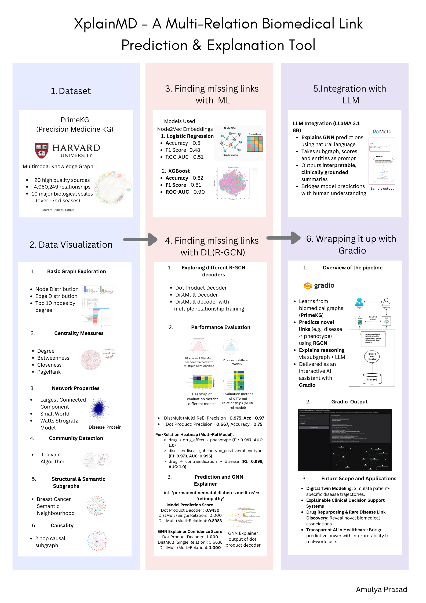
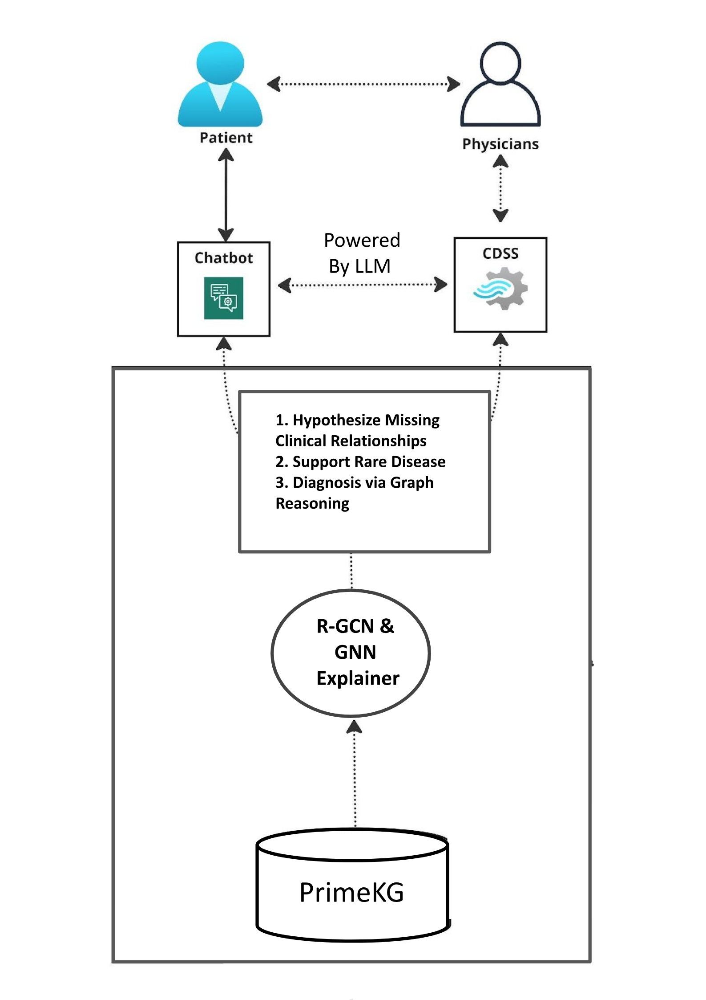
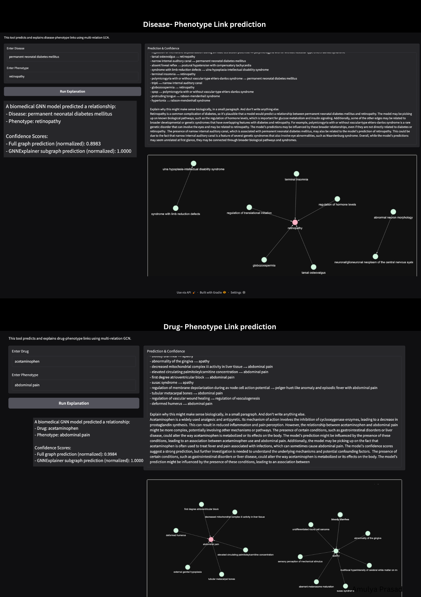

# XplainMD: A Multi-Relation Biomedical Link Prediction & Explanation 
Tool

XplainMD is an explainable AI pipeline built on PrimeKG (a precision medicine Knowledge graph) for predicting and interpreting complex clinical relationships like 
disease–phenotype or drug–effect links. It combines **graph neural 
networks**, and **LLM-powered explanations** to 
bridge the gap between **black-box models** and **clinically grounded 
reasoning**.

---

##  Overview of the Project

  

---

## XplainMD Architecture

  

##  Dataset: PrimeKG

In this project, I have  used  **PrimeKG**, a curated precision medicine knowledge graph developed 
by Harvard, containing:

- 4M+ biomedical relationships
-  10+ biological entity types (diseases, genes, drugs, phenotypes, 
etc.)
- 20+ data sources

---

##  Highlights

### 1. Data Visualization

- Graph stats, node degree, community detection
- Centrality metrics (degree, closeness, betweenness)
- Causal subgraph extraction

### 2. Missing Link Prediction

- **ML Models:** Node2Vec + XGBoost
- **DL Models:** Multi-relational R-GCN with Dot Product & DistMult 
decoders

### 3. Explainability

- **GNNExplainer** generates subgraphs contributing to the prediction
- **LLMs (LLaMA 3.1 8B)** explain predictions in **natural language**
  
### 4. Gradio Deployment

- Users input a disease or drug + phenotype
- The system predicts the link, visualizes the subgraph, and explains it 
with an LLM

---

##  Output 

  

---

##  License

This project is under the **Creative Commons BY-NC-ND 4.0 License**.  
You may **view, fork, and reference**, but **no commercial use or 
modification** is allowed.

---

## Future Scope

- Digital Twin Models for patient-specific trajectories  
- Clinical decision support assistant  
- Explainable rare disease inference  
- Transparent AI for biomedical research

---
## Key Features

- **Multi-relation link prediction** with R-GCN + DistMult
- **Prediction Explanation** using GNNExplainer  
- **Biomedical explanation** using LLaMA 3.1 8B  
- **Subgraph visualization** using PyVis  
- **User-friendly chatbot interface** using Gradio  
- Applications in **drug repurposing** & **clinical decision support systems (CDSS)**  

---

##  Citation & Acknowledgements

Built using:  
- [PrimeKG](https://github.com/mims-harvard/PrimeKG)  
- [PyTorch Geometric](https://pytorch-geometric.readthedocs.io/en/latest/)  
- [Meta LLaMA 3.1 8B](https://ai.meta.com/llama/)  

---

##  Let's Connect

If you find this useful or want to collaborate, feel free to reach out at fhirshotlearning@gmail.com  or **⭐️ star the repo**!

### Developed by Amulya Prasad

